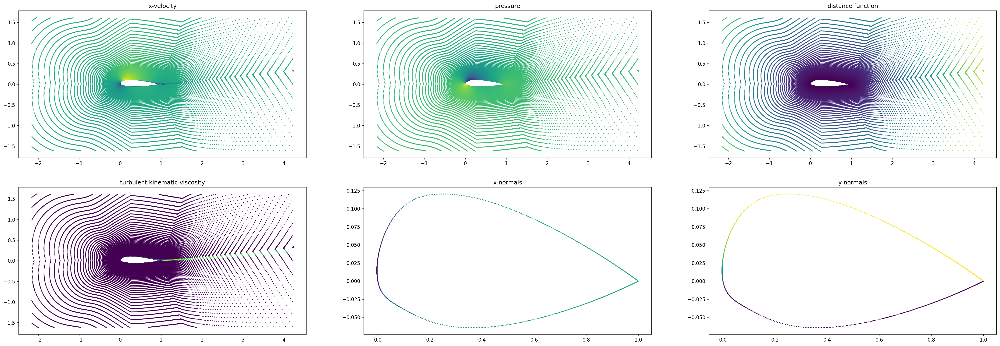
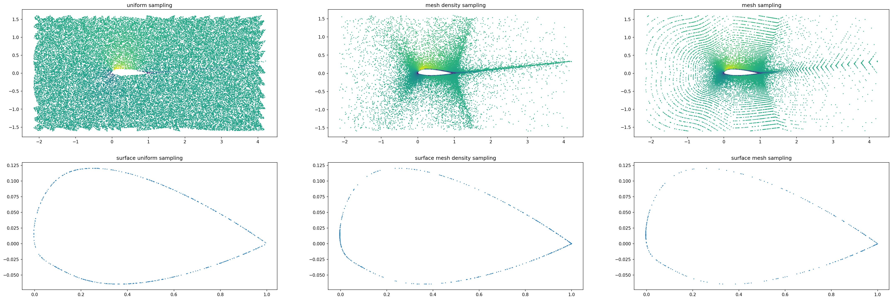

Simulation
==========

Each simulation is defined via boundary conditions (inlet velocity and angle of attack) and a geometry (NACA 4 or 5 digits). We recall that in an incompressible setup and when neglecting gravity, the only parameter of Navier-Stokes equations (and also of RANS equations) is the Reynolds number. If we fix the kinematic viscosity (`i.e.` if we fix the temperature of air one for all), the Reynolds number is completely defined by the inlet velocity (as the characteristic length of airfoil is chosen to be 1 meter). In this dataset, we chose to arbitrarily fix the temperature to 298.15K and to work with properties of air at that temperature, at a pressure of 1013.25 hPa.

You can run new simulation with the help of `OpenFOAM v2112 <https://www.openfoam.com/>`_ and the `NACA simulation GitHub <https://github.com/Extrality/NACA_simulation>`_.

.. note::

	During the generation of the dataset, we fixed the kinematic viscosity at a numerical value of 1.56e-5. After the addition of the temperature parameters in the simulation, the computed kinematic viscosity at 298.15K is of roughly 1.55e-5 leading to slight discrepancies at a fix inlet velocity between newly generated simulations and simulations from the dataset. Those discrepencies do not exist if we only take as parameter the Reynolds number.

In the following, we present attributes and methods of the :class:`airfrans.Simulation` class.

To load a simulation (for example simulation ``'airFoil2D_SST_43.597_5.932_3.551_3.1_1.0_18.252'``), simply run:

.. code-block:: python

	import airfrans as af
	
	simulation = af.Simulation(root = PATH_TO_DATASET, name = 'airFoil2D_SST_43.597_5.932_3.551_3.1_1.0_18.252', T = 298.15)

Attributes
----------

One part of the attributes of the class is the properties of air at the given temperature:

- :obj:`airfrans.Simulation.MOL` is the molar weigth of air in :math:`kg\cdot mol^{-1}`
- :obj:`airfrans.Simulation.P_ref` is the reference pressure in :math:`Pa`
- :obj:`airfrans.Simulation.RHO` is the specific mass in :math:`kg\cdot m^{-3}`
- :obj:`airfrans.Simulation.NU` is the knimeatic viscosity in :math:`m^2\cdot s^{-2}`
- :obj:`airfrans.Simulation.C` is the sound velocity in :math:`m\cdot s^{-1}`.

A second part is the boundary conditions:

- :obj:`airfrans.Simulation.inlet_velocity` is the inlet velocity in :math:`m\cdot s^{-1}`
- :obj:`airfrans.Simulation.angle_of_attack` is the angle of attack in :math:`rad`.

A third part is the PyVista object of the reference simulation:

- :obj:`airfrans.Simulation.internal` is the PyVista object of the internal patch
- :obj:`airfrans.Simulation.airfoil` is the PyVista object of the aerofoil patch

Finally, the last part is the fields associated with the simulation under the form of NumPy ndarray. Those fields are either defined on the mesh nodes, are the airfoil patch nodes directly:

- :obj:`airfrans.Simulation.input_velocity` is the inlet velocity copied on each nodes of the internal mesh in :math:`m\cdot s^{-1}`
- :obj:`airfrans.Simulation.sdf` is the distance function on the internal mesh in :math:`m`
- :obj:`airfrans.Simulation.surface` is a boolean on the internal mesh, it is ``True`` if the node lie on the airfoil
- :obj:`airfrans.Simulation.position` is the position of the nodes of the internal mesh in :math:`m`
- :obj:`airfrans.Simulation.airfoil_position` is the position of the nodes of the airfoil mesh in :math:`m`
- :obj:`airfrans.Simulation.normals` is the outpointing normals of the surface on the internal mesh, it is set to 0 for points not lying on the airfoil
- :obj:`airfrans.Simulation.airfoil_normals` is the outpointing normais of the surface on the airfoil mesh

and for the targets:

- :obj:`airfrans.Simulation.velocity` is the air velocity on the internal mesh in :math:`m\cdot s^{-1}`
- :obj:`airfrans.Simulation.pressure` is the air pressure on the internal mesh (divided by the specific mass in the incompressible case)
- :obj:`airfrans.Simulation.nu_t` is the kinematic turbulent viscosity on the internal mesh in :math:`m^2\cdot s^{-2}`

.. code-block:: python

	import matplotlib.pyplot as plt
	
	fig, ax = plt.subplots(3, 2, figsize = (36, 12))
	ax[0, 0].scatter(simulation.position[:, 0], simulation.position[:, 1], c = simulation.velocity[:, 0], s = 0.75)
	ax[0, 1].scatter(simulation.position[:, 0], simulation.position[:, 1], c = simulation.pressure[:, 0], s = 0.75)
	ax[0, 2].scatter(simulation.position[:, 0], simulation.position[:, 1], c = simulation.sdf[:, 0], s = 0.75)
	ax[1, 0].scatter(simulation.position[:, 0], simulation.position[:, 1], c = simulation.nu_t[:, 0], s = 0.75)
	ax[1, 1].scatter(simulation.airfoil_position[:, 0], simulation.airfoil_position[:, 1], c = simulation.airfoil_normals[:, 0], s = 0.75)
	ax[1, 2].scatter(simulation.airfoil_position[:, 0], simulation.airfoil_position[:, 1], c = simulation.airfoil_normals[:, 1], s = 0.75)
	...
	

.. note::
	
	Be careful that the ordering of points over the airfoil in the internal mesh or in the airfoil mesh is not the same. The function :obj:`airfrans.reorganize` is built to reordered the points as we want.

.. code-block:: python
	
	internal_normals = simulation.normals[simulation.surface]	
	print((internal_normals == simulation.airfoil_normals).all())
	>> False
	
	reordered_normals = af.reorganize(simulation.position[simulation.surface], simulation.airfoil_position, internal_normals)	
	print((reordered_normals == simulation.airfoil_normals).all())
	>> True

Methods
-------

Sampling methods are available allowing to potentially free the constrainte of the mesh structure:

- :obj:`airfrans.Simulation.sampling_volume` allows sampling from two different densities on the internal mesh domain
- :obj:`airfrans.Simulation.sampling_surface` allows sampling from two different densities on the airfoil mesh domain
- :obj:`airfrans.Simulation.sampling_mesh` allows the sampling of nodes in the internal mesh

.. code-block:: python

	sampling_volume_uniform = simulation.sampling_volume(50000, density = 'uniform')
	sampling_volume_mesh = simulation.sampling_volume(50000, density = 'mesh_density')
	
	sampling_surface_uniform = simulation.sampling_surface(500, density = 'uniform')
	sampling_surface_mesh = simulation.sampling_surface(500, density = 'mesh_density')
	
	sampling_mesh = simulation.sampling_mesh(50000)
	sampling_mesh_surface = sampling_mesh[sampling_mesh[:, 2].astype('bool')]
	
	fig, ax = plt.subplots(2, 3, figsize = (36, 12))
	ax[0, 0].scatter(sampling_volume_uniform[:, 0], sampling_volume_uniform[:, 1], c = sampling_volume_uniform[:, 3], s = 0.75)
	ax[0, 1].scatter(sampling_volume_mesh[:, 0], sampling_volume_mesh[:, 1], c = sampling_volume_mesh[:, 3], s = 0.75)
	ax[0, 2].scatter(sampling_mesh[:, 0], sampling_mesh[:, 1], c = sampling_mesh[:, 8], s = 0.75)
	ax[1, 0].scatter(sampling_surface_uniform[:, 0], sampling_surface_uniform[:, 1], s = 0.75)
	ax[1, 1].scatter(sampling_surface_mesh[:, 0], sampling_surface_mesh[:, 1], s = 0.75)
	ax[1, 2].scatter(sampling_mesh_surface[:, 0], sampling_mesh_surface[:, 1], s = 0.75)
	...
	

You can also directly compute the wall shear stress and the force coefficient with the class attributes or the reference simulation:

.. code-block:: python

	simulation.velocity = np.zeros_like(simulation.velocity)
	simulation.pressure = np.zeros_like(simulation.pressure)
	
	print(simulation.force())
	>> (array([0., 0.]), array([-0., -0.]), array([0., 0.]))
	
	print(simulation.force(reference = True))
	>> (array([-79.15, 907.93]), array([-87.92, 906.80]), array([8.78, 1.14]))
	
	print(simulation.force_coefficient())
	>> ((0.0, 0.0, 0.0), (0.0, 0.0, 0.0))
	
	print(simulation.force_coefficient(reference = True))
	>> ((0.0134, 0.0056, 0.0079), (0.8099, 0.8097, 0.0002))
	
Some classical metrics between the attributes fields/forces and the reference fields/forces, for example the mean squared error:

.. code-block:: python
	
	print(simulation.mean_squared_error())
	>> array([1100.53, 228.03, 227577.73, 0.])
	
	simulation.reset()
	print(simulation.mean_squared_error())
	>> array([0., 0., 0., 0.])
	
Finally, you can save new ``.vtu`` and ``.vtp`` files with the fields given in attributes of the class:

.. code-block:: python
	
	simulation.save(root = SAVING_PATH)
