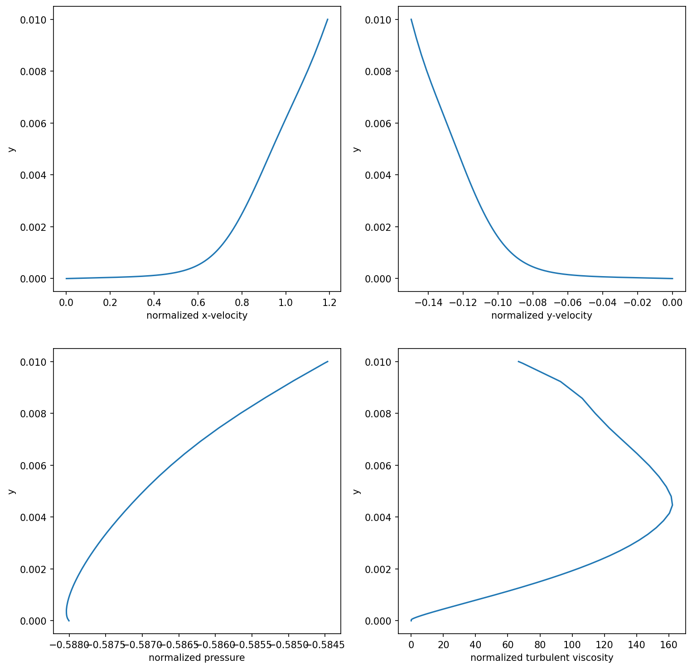
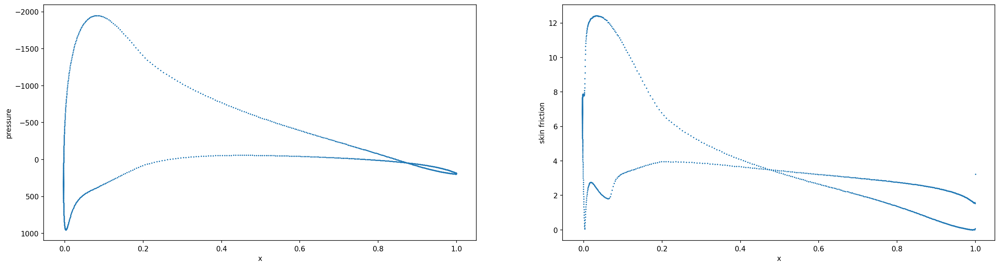

Visualization
=============

Visualizations entire simulations is often not sufficient to qualitatively assess the performance of a model. Boundary layers or trails are important parts of dynamics and they are often very localized leading to difficulties to visualize performances through a global representation of the simulation.

We encourage the usage of `ParaView <https://www.paraview.org/>`_ and one of its pythonic interface `PyVista <https://docs.pyvista.org/>`_ to manipulate and visualize the saved ``.vtu`` or ``.vtp`` generated with the ``save`` method of the :class:`airfrans.Simulation` class. 

Boundary layers plots
---------------------

However, we propose a ready-to-use method :obj:`airfrans.Simulation.boundary_layer` for visualizing boundary layers and trails to facilitate workflows. This method is a wrapper of the ``Plot Over Line`` function of ParaView using PyVista. Note that this method uses the fields given in the attribute of the Simulation class to generate the line sampling.

.. code-block:: python

	import airfrans as af
	import matplotlib.pyplot as plt
	
	# Sample the boundary layer
	simulation = af.Simulation(root = PATH_TO_DATASET, name = 'airFoil2D_SST_43.597_5.932_3.551_3.1_1.0_18.252')
	boundary_layer = simulation.boundary_layer(x = 0.5, y = 0.01)
	
	# Plot the sampling with matplotlib
	fig, ax = plt.subplots(2, 2, figsize = (12, 12))
	ax[0, 0].plot(boundary_layer[1], boundary_layer[0])
	...
	

Surface plots
-------------
	
You could also need to check the predictions of your model over the airfoil. The important quantities are the pressure and the intensity of the wall shear stress (also called the skin friction), computed via the jacobian of the velocity via :obj:`airfrans.Simulation.wallshearstress`.

.. code-block:: python
	
	import numpy as np
	import airfrans as af
	import matplotlib.pyplot as plt
	
	# Compute the wall shear stress
	simulation = af.Simulation(root = PATH_TO_DATASET, name = 'airFoil2D_SST_43.597_5.932_3.551_3.1_1.0_18.252')
	norm_wss = np.linalg.norm(simulation.wallshearstress()[simulation.surface], axis = 1)
	
	# Plot the sampling with matplotlib
	fig, ax = plt.subplots(1, 2, figsize = (24, 6))
	ax[0].plot(simulation.position[simulation.surface, 0], simulation.pressure[simulation.surface, 0], s = 0.75)
	ax[1].plot(simulation.position[simulation.surface, 0], norm_wss, s = 0.75)
	...

